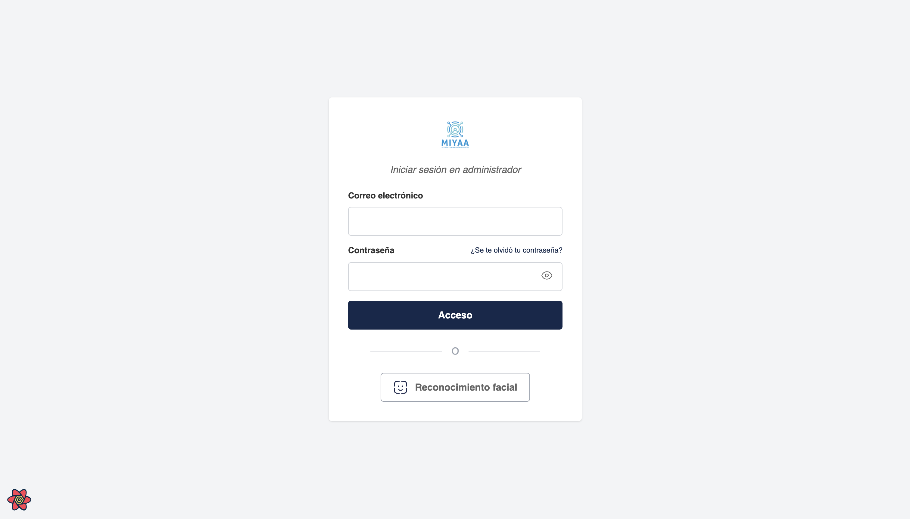
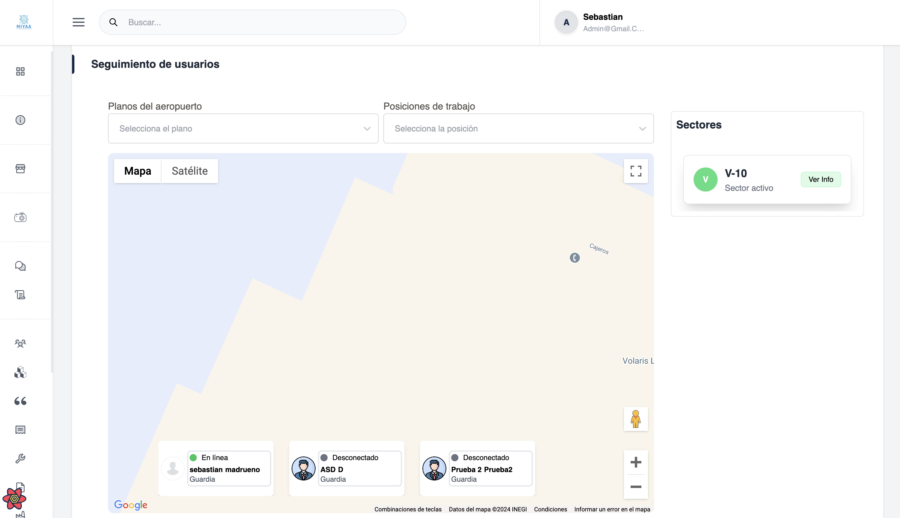

# Miyaa Admin - Frontend

This is an administration project developed with **Next.js**, which allows real-time tracking of devices, interaction with **Google Maps**, and managing messaging between users. Additionally, it includes functionalities for user registration, document management, and other administrative tasks.

| Image 1 | Image 2 |
| -------- | -------- |
|  |  |

### Technologies Used

- **Next.js**: React framework for building high-performance, scalable web applications.
- **React**: Library for building interactive user interfaces.
- **Google Maps API**: For tracking and visualizing devices on an interactive map.
- **Tailwind CSS**: CSS framework for fast and responsive design.
- **Jest**: For unit and integration testing.
- **TypeScript**: To improve code safety and maintainability.
- **Axios**: For making HTTP requests.

### Project Features

- **Real-time tracking**: Monitoring of devices on a Google Maps map with live updates of coordinates.
- **Admin Interface**: Intuitive dashboard with interactive charts.
- **Real-time messaging**: Users can send messages to each other.
- **User Management**: Registration, authentication, and tracking of user actions.
- **Alert Management**: Tracking of incidents.
- **Role Management**: Registration of job roles.
- **Document Type Management**: Registration of documents assigned to job roles.
- **Round Management**: Registration and tracking of rounds.
- **Sector Management**: Registration and management of sectors.
- **Documents**: Registration and validation of document handling associated with each user.
- **Categories and Notes**: Registration and tracking of note categories and the notes to be published.
- **Settings**: Registration and tracking of general system settings.
- **Terms and Conditions**: Registration and tracking of the system's terms and conditions.

## Requirements

Make sure you have the following tools installed:

- **Node.js** version **>=20.0.0** (but this project is optimized for Node 22)
- **npm** version **>=10.8.3**

## Installation

1. **Clone the repository**:

   ```bash
   git clone <repository-url>
   cd <repository-name>

2. **Install dependencies**:

Install all the necessary dependencies for the project:

    npm install 

If you prefer to use **Yarn**:

    yarn install

3. **Set up environment variables**

Create a .env.local file in the root directory of the project and add the following environment variables (for example, the Google Maps API key):

    GOOGLE_MAPS_API_KEY=tu_api_key_de_google_maps

## Development Scripts

Once the dependencies are installed and the environment variables are configured, you can use the following commands for development and running the project:

1. **Start the development server**

To start the server in development mode on port 3009:

    npm run dev
    
    yarn dev

This command will open the application at <http://localhost:3009> so you can test it in your local environment.

## Build the Project

To build the project for production:

    npm run build

    yarn build
